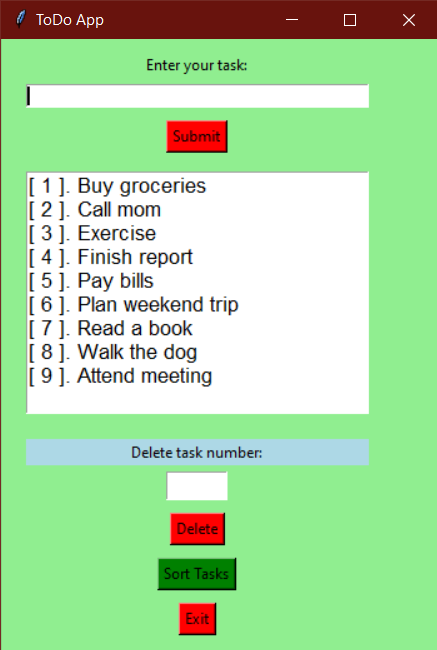

# Simple Tkinter To-Do App

This is a basic To-Do list application built using Python's Tkinter library. It allows users to add, delete, and sort tasks.  The app provides a simple and intuitive graphical interface for managing a list of to-dos.

## Features

* **Add Tasks:** Enter a task in the entry field and click "Submit" to add it to the list.
* **Delete Tasks:** Enter the number corresponding to the task you want to delete and click "Delete".
* **Sort Tasks:** Click "Sort Tasks" to sort the to-do list alphabetically.
* **Clear Input:** The input field is automatically cleared after submitting a task.
* **Error Handling:** Includes input validation and error messages for invalid input (e.g., empty task, non-numeric delete input, deleting non-existent tasks).
* **Dynamic Updates:** The task list display updates automatically after adding, deleting, or sorting tasks.

## Requirements

* Python 3
* Tkinter (usually included with Python installations)

## How to Run

1. Save the `main.py` file.
2. Open a terminal or command prompt.
3. Navigate to the directory where you saved `main.py`.
4. Run the script using the command: `python main.py`

## Usage

1. **Adding a Task:** Type the task in the "Enter your task" field and click "Submit".
2. **Deleting a Task:**  Enter the number of the task (as displayed in the list) you want to delete in the "Delete task number" field and click "Delete".
3. **Sorting Tasks:** Click the "Sort Tasks" button to sort the list alphabetically.
4. **Exiting:** Click the "Exit" button to close the application.

## Example

## Testing

Click to expand test cases

# To-Do App Test Cases

This document outlines the test cases for the To-Do app, covering different functionalities and scenarios.

## Phase 1: Adding Tasks

* **Test Case 1: Add Simple Tasks:**
    * Input: "Buy groceries", "Call mom", "Finish report", "Walk the dog"
    * Expected Result: Tasks are added to the list and displayed correctly.
    * Screenshot:   

* **Test Case 2: Add Empty Task:**
    * Input: (Empty input field), click "Submit"
    * Expected Result: "Input Error" message box appears.
    * Screenshot:  

## Phase 2: Sorting Tasks

* **Test Case 1: Sort with Existing Tasks:**
    * Input: Click "Sort Tasks" with the tasks from Phase 1.
    * Expected Result: Tasks are sorted alphabetically ("Buy groceries", "Call mom", "Finish report", "Walk the dog").
    * Screenshot: 

        Before  

        After   

* **Test Case 2: Sort with New Task Affecting Order:**
    * Input: Add "Attend meeting", then click "Sort Tasks".
    * Expected Result: "Attend meeting" appears at the beginning of the sorted list.

* **Test Case 3: Sort Empty List:**
    * Input: Click "Sort Tasks" with an empty task list.
    * Expected Result: "Info" message box appears saying "No tasks to sort."
    * Screenshot:  

## Phase 3: Deleting Tasks

* **Test Case 1: Delete Middle Task:**
    * Input: Enter the number of a middle task (e.g., "2" if there are 4 tasks) in the "Delete task number" field, click "Delete".
    * Expected Result: The specified task is removed, and the remaining tasks renumber.

* **Test Case 2: Delete First Task:**
    * Input: Enter "1" in the "Delete task number" field, click "Delete".
    * Expected Result: The first task is removed.

* **Test Case 3: Delete Last Task:**
    * Input: Enter the number of the last task, click "Delete".
    * Expected Result: The last task is removed.

* **Test Case 4: Delete with Empty Input:**
    * Input: Leave "Delete task number" field empty, click "Delete".
    * Expected Result: "Input Error" message box with "Please enter a valid number."
    * Screenshot:  

           Result 

* **Test Case 5: Delete with Non-Numeric Input:**
    * Input: Enter "abc" in "Delete task number", click "Delete".
    * Expected Result: "Input Error" message box with "Please enter a valid number."  *(Same screenshot as Test Case 4 could be used)*

* **Test Case 6: Delete with Number Too High:**
    * Input: Enter a number greater than the number of tasks, click "Delete".
    * Expected Result: "Input Error" message box with "Invalid task number."

* **Test Case 7: Delete with Number Too Low (0 or negative):**
    * Input: Enter "0" or "-1", click "Delete".
    * Expected Result: "Input Error" message box with "Invalid task number."

* **Test Case 8: Delete from Empty List:**
    * Input: Click "Delete" with an empty task list.
    * Expected Result: "Error" message box with "No tasks to delete."
    * Screenshot:  

           Result 

## Phase 4: Exit Functionality

* **Test Case 1: Exit Application:**
    * Input: Click "Exit".
    * Expected Result: The application closes cleanly.

## Future Enhancements

* **Data Persistence:** Save the task list to a file so that it persists between sessions.
* **Search Functionality:** Add the ability to search for specific tasks.
* **GUI Improvements:**  Improve the visual design and layout of the app.
* **Prioritization:** Allow users to prioritize tasks.
* **Due Dates:**  Add functionality to set due dates for tasks.

## Contributing

Contributions are welcome! Feel free to open issues or submit pull requests.

## License

This project is licensed under the MIT License. See the `LICENSE` file for details. (You might want to create a LICENSE file if you plan to use one).